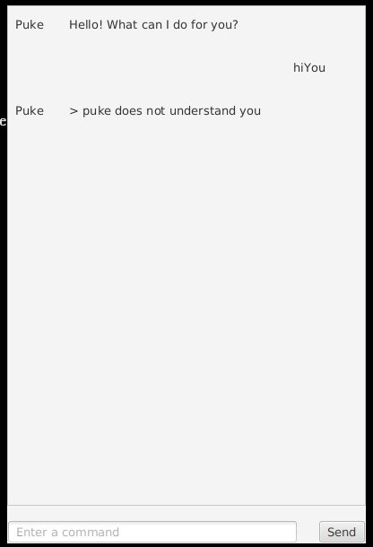

# Puke - Task Sprite



Puke is a mildly dramatic task sprite that helps you keep track of todos,
deadlines, and events. Use the JavaFX window or the command-line interface to
send commands.

## Commands

| Command | Example | Purpose |
| --- | --- | --- |
| `todo` | `todo read chapter 1` | Add a todo task |
| `deadline` | `deadline submit report /by 2026-09-20` | Add a task with a deadline |
| `event` | `event project meeting /from 2pm /to 4pm` | Add an event |
| `list` | `list` | Show all tasks |
| `mark` | `mark 2` | Mark a task as done |
| `unmark` | `unmark 2` | Mark a task as not done |
| `delete` | `delete 2` | Remove a task |
| `find` | `find report` | Find tasks containing a keyword |
| `bye` | `bye` | Exit Puke |

Tasks are saved automatically in `data/puke.txt`. Puke rejects duplicate
tasks, reports malformed commands, and skips malformed records without losing
valid tasks already stored in the file.

## Running Puke

Use Java 25 and run the JavaFX application with Gradle:

```bash
./gradlew run
```

To create the distributable fat JAR:

```bash
./gradlew clean shadowJar
java -jar build/libs/puke.jar
```
